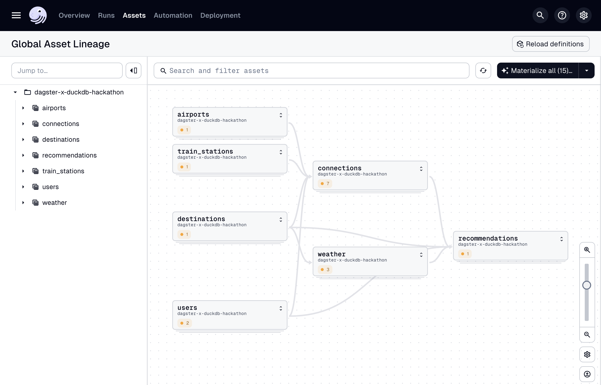

# BDR Dagster Hackathon

Welcome to the repo for BDR's Dagster Hackathon!

We will be taking on the role of a startup that wants to come up with dream
holiday ideas for their customers. We will do this by building a new 
data product that creates travel recommendations, based on multiple data
sources, and is orchestrated by Dagster.

Read on on how to use this repo as a guided tutorial and how to setup your
local development environment.

The **assignments** are also listed further in this document.

## How to use this repo

We will teach different ways to use Dagster through several tasks. Each task
can be accessed by checking out a different branch:

* `main` – contains only the instructions on how to setup your local 
 environment and to use this repo.
* `hackathon-task1` – ready for the implementation of Task 1.
* `hackathon-task2` – ready for the implementation of Task 2.
* `hackathon-task3` – ready for the implementation of Task 3.
* `hackathon-task4` – ready for the implementation of Task 4.
* `hackathon-final` – our full solution, with a suggestion left open-ended for
 expansion.

**NOTE**: We advise you to create a new branch when working on your tasks,
as we will be providing a working solution after each step. For example,
name your branch something like `hackathon-task2-inge` and commit your changes.

## Setup

### System requirements

* Python :)
* [uv](https://docs.astral.sh/uv/guides/install-python/) Python package manager. 
* Install DuckDB, for example with `brew install duckdb`
* Generate user data with: `uv run data/usergen.py`

### Project installation

1. Sync you local development environment with: `uv sync --dev`
2. Set an environment variable with `export DAGSTER_HOME=/tmp/bdr_dagster_hackaton`
3. Start Dagster with `uv run dg dev` and open the [web UI](http://127.0.0.1:3000)

**NOTE**: ignore the sensor errors in the terminal for now.

## Asset overview
At the heart of this project are the Dagster assets that bring our dream-holiday recommendation engine to life. Think of these assets as the different departments of our little startup: each one has a role to play in turning raw data into personalized travel advice for our customers.



### Core Data Assets

This is where we gather the foundational information – our raw ingredients.

- **Users**: Who are our customers, where do they live, and what do they prefer (temperature, travel time, transport mode)?

- **Destinations**: A collection of possible holiday spots across Europe, enriched with geospatial points.

- **Airports**: Large airports across Europe, filtered from open data sources.

- **Train Stations**: Major European train stations, ensuring connectivity for rail-loving travelers.

- **Historic Weather**: Yearly weather data for destinations, fetched from the [Open-Meteo API](https://open-meteo.com/en/docs)

### Connections & Enrichment

Here we process and combine the data, much like planning out the routes, tickets and weather info that make trips feasible.

**Nearest Hubs**: For both users and destinations, we find the closest airports and train stations.

**Connections (Airports & Train Stations)**: Calculate travel distances and approximate travel times between users and destinations by different modes of transport.

**Unified Connections**: Merge air and rail connections into a single dataset for comparison.

**Weather Forecast**: From raw weather data, we aggregate average monthly conditions so customers know what to expect.

### Recommendations

Finally, the magic happens. This is where we bring everything together into a recommendation engine.

**Recommendations**: For each user, we combine travel preferences, weather forecasts and travel connections to generate ranked holiday suggestions. We calculate a “penalty score” for each option (based on mismatches in travel time and preferred temperature) and return the top destinations.

### Marimo

Once we have our recommendations, we can have a look at them in marimo by running 

```
uv run marimo run dashboard.py
```


## Assignments

The data assets as described, however, are not fully implemented yet. That's where you come in. By completing the following assignments, we will bring together the recommondation pipeline one step at a time. We will start off with a quick introduction to Dagster's most important features. 

Please note, if you ever get stuck, please reach out or check the final solution branch `hackathon-final` for inspiration.

### :seedling: Task 1: Create your first asset

_Create a new asset from a CSV about potential holiday destinations._

Branch: `hackathon-task1`

To start you off on your Dagster journey, you are given a CSV file. Create a
new asset called `destinations` and read in all the columns from the CSV,
giving each row a unique ID.

Test out your solution by starting the local Dagster instance and 
materializing your new asset.

**TIP**: utilize Dagster's quick feedback loop with `uv run dg dev`

**TIP**: you can use the [st_point](https://duckdb.org/docs/stable/core_extensions/spatial/functions.html#st_point)
function to read in longitude and latitude as a GEOMETRY type (from the 
spatial extension).

---

### :rabbit2: Task 2: Computed asset

_Create assets that link the users with potential destinations, calculating the
shortest distance and travel time._

Branch: `hackathon-task2`

This will help us select optimal routes for our holiday ideas later on.

Alongside our `destinations` asset, you are now given the following new assets:
* [users](./src/dagster_x_duckdb_hackathon/defs/assets/users.py)
* [airports](./src/dagster_x_duckdb_hackathon/defs/assets/hubs.py)
* [train_stations](./src/dagster_x_duckdb_hackathon/defs/assets/hubs.py)

(Materialize the `users` asset in the UI to resolve the sensor error in the terminal)

As well as a helper function [build_nearest_hub_asset](./src/dagster_x_duckdb_hackathon/defs/assets/connections.py)
that can dynamically generate an asset that represents closest connections by 
geometric distance.

#### Part 1:

Create the following (intermediate) computed assets:
* `destinations_airports`
* `destinations_train_stations`
* `users_airports`
* `users_train_stations`

Linking all users and destinations with all transport hubs, using the 
`build_nearest_hub_asset` helper function.

#### Part 2:

Create the following computed assets:
* `connections_train_stations` – using `users_train_stations` and `destinations_train_stations`
* `connections_airports` – using `users_airports` and `destinations_airports`
* `connections` (union of the two above)

With the following schema:
* `users_id` – an ID from the users table.
* `destinations_id` – and ID from the destinations table.
* `connection_distance` – (linear) distance between the two.
* `transport_mode` – 'train' or 'flight'.
* `travel_time` – estimated based on connection_distance.

---

### :sun_with_face: Task 3: External asset

_Query an (external) API for weather data._

Branch: `hackathon-task3`

In order to select the right kind of holiday destination we would like to use
weather data to match it with our users' preferences.

Create an asset that reads historical weather data from Open Meteo. 

You can try to create an asset that reads from the API directly by reading the [Dagster docs](https://docs.dagster.io/guides/build/external-resources/connecting-to-apis).

**NOTE**: Alternatively, use the [get_historical_data](./data/get_historical_data.py) script to dump the historical
data to a file, and proceed like before by reading CSV files.

---

### :rocket: Task 4: Open ended

_Generate travel recommendations based on input data._

Branch: `hackathon-task4`

Now that we have collected and processed data from different sources,
we are ready to generate travel recommendations for our users.

The solution of this assignment is meant to be open-ended. One solution would be to use
`travel_time` and `preferred_temperature` to rank destinations for all users.

You may also think about expanding on the given input data by defining new assets or even plugging in a 
`scikit-learn` model [into Dagster](https://docs.dagster.io/guides/build/ml-pipelines/ml-pipeline). 

**NOTE**: As mentioned in the data overview section, we have provided a ranking solution in the `hackathon-final` branch as an example. However, 
you are encouraged to experiment and find things out on your own.

**NOTE**: Don't forget about the marimo dashboard! 

---

### :books: Task 5 (bonus round): Data engineering improvements 

_Explore Dagster's features regarding data engineering_

Branch: `hackathon-task4`

Dagster offers a lot of features related to data engineering. In this bonus assignment, you're encouraged to implement (in order of increasing complexity): 

- Add relevant metadata to the implemented assets 
- Making an asset parameterizable through `@asset(config_schema=...)`
- Different types of partitioning, considering which makes the most sense for our assets
- Explore `@dg.observable_source_asset` and `@dg.sensor` to check data freshness

**NOTE**: We also included implementations of these features in the `hackathon-final` branch.

## Debugging

### DuckDB

Start DuckDB with this project's database with: `duckdb db.duckdb`

Type `.help` for a list of commands, but otherwise you can use it in a similar
way to other SQL database. Some examples:

List tables: `.tables`

Select users: `SELECT * FROM users LIMIT 10;`

Read 
```
SELECT
    row_number() OVER () as id,
    * exclude (latitude, longitude),
    st_point(longitude::double, latitude::double) as geom
FROM 'data/destinations.csv';
```

### Marimo notebooks

Enter edit mode for the dashboard with: `uv run marimo edit dashboard.py`

Marimo tutorial: `uv run marimo tutorial intro`
